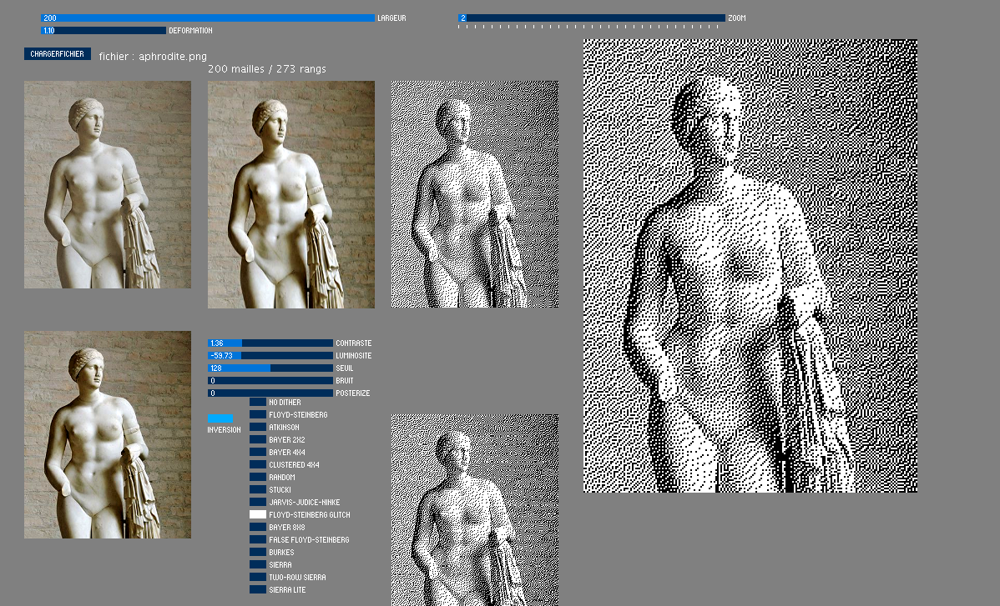
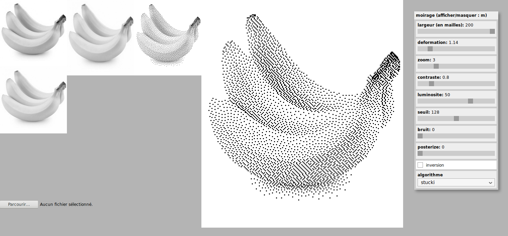

# Tricot-Machine

Applications et scripts utiles pour utiliser des machines à tricoter Brother Electroknit (KH940 principalement)

Voir aussi http://lesporteslogiques.net/wiki/outil/machine_a_tricoter_brother_kh940/start

## Tramage

Pour tricoter en deux couleurs. Ces applications permettent de créer de modifier interactivement le tramage d'une image de départ, de modifier ses caractéristiques (contraste, luminosité, inversion), d'ajouter une  déformation en longueur et d'enregistrer au format PNG 1-bit (format lu par knittington). Différents algorithmes de tramage sont disponibles : Floyd-Steinberg, Bayer 2x2, Bayer 4x4, Bayer 8x8, Clustered 4x4, Random, Stucki, Jarvis-Judice-Ninke, Burkes, Sierra, Two row Sierra, Sierra lite, Atkinson, etc.

Application en deux versions : processing et p5.js, la version p5.js est utilisable en ligne : [tramage pour tricot-machine](http://lesporteslogiques.net/tricot-machine/tramage/)

Les deux versions sont fonctionnelles, mais la version en ligne est à privilégier car elle est un peu plus aboutie!

### Tramage version processing

### Tramage version p5.js

