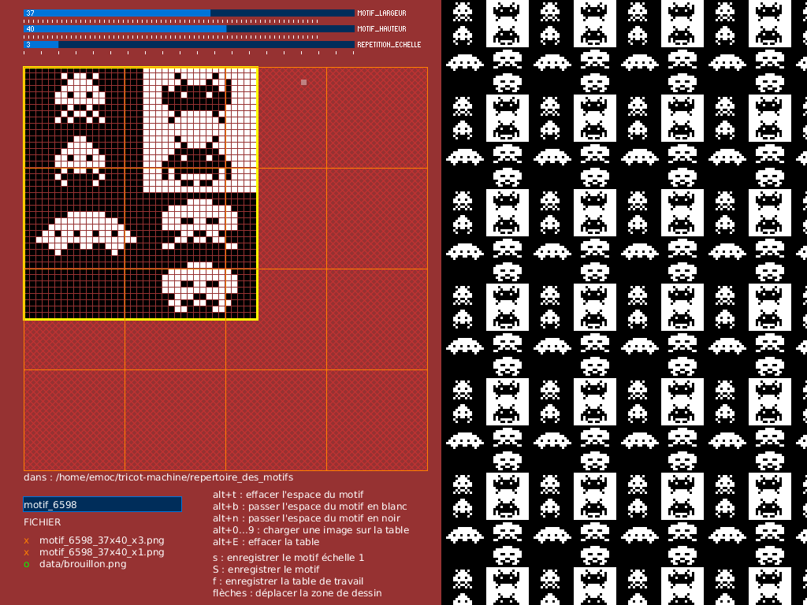
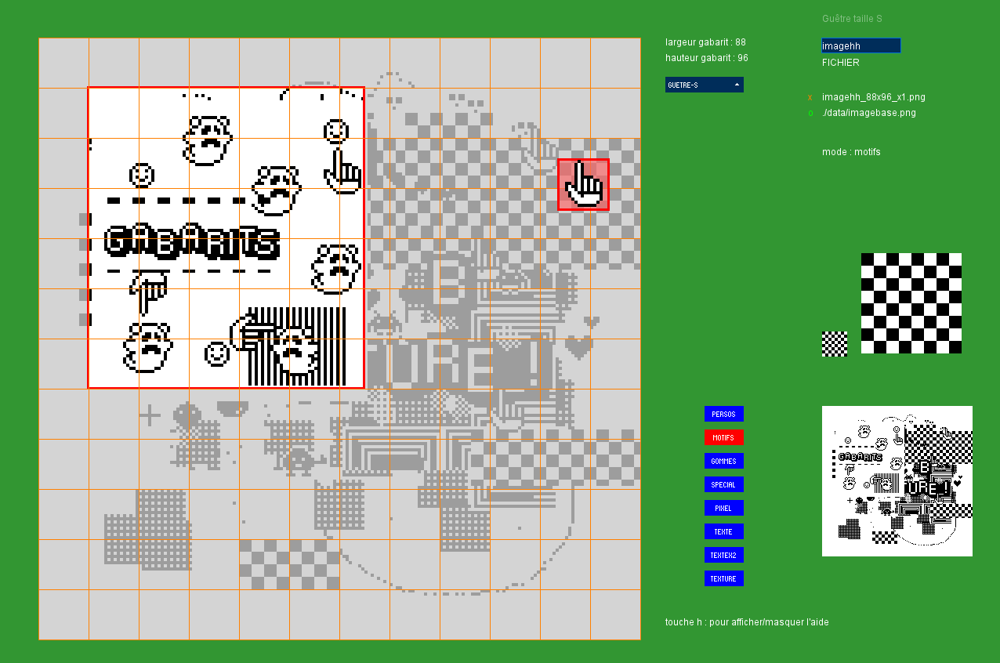
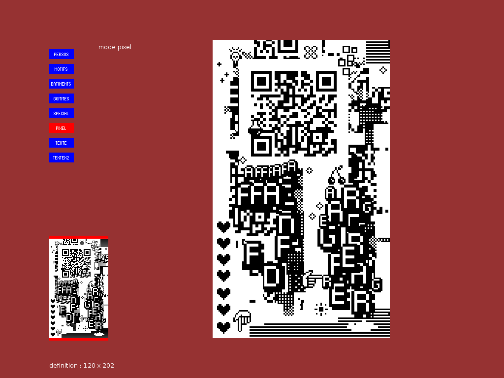
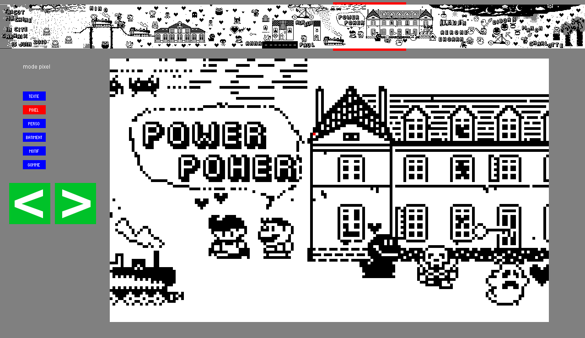

# Tricot-Machine

Applications et scripts utiles pour utiliser des machines à tricoter Brother Electroknit (KH940 principalement). Ces applications ont été écrites au fil du temps et des projets. En résumé les plus utiles sont **motif_v005** et **gabarits_v001**: motif_v005 permet de créer des motifs en 3 couleurs (couleur de fond, couleur de contraste, transparent) et gabarits_v001 permet de les assembler sur des gabarits à tricoter (bonnet, mitaine, guêtre)

Voir aussi http://lesporteslogiques.net/wiki/outil/machine_a_tricoter_brother_kh940/start  

## Tramage

Pour tricoter en deux couleurs. Ces applications permettent de modifier interactivement le tramage d'une image de départ, de modifier ses caractéristiques (contraste, luminosité, inversion), d'ajouter une  déformation en longueur et d'enregistrer au format PNG 1-bit (format lu par knittington). Différents algorithmes de tramage sont disponibles : Floyd-Steinberg, Bayer 2x2, Bayer 4x4, Bayer 8x8, Clustered 4x4, Random, Stucki, Jarvis-Judice-Ninke, Burkes, Sierra, Two row Sierra, Sierra lite, Atkinson, etc.

Application en deux versions : processing et p5.js, la version p5.js est utilisable en ligne : [tramage pour tricot-machine](http://lesporteslogiques.net/tricot-machine/tramage/)

Les deux versions sont fonctionnelles, mais la version en ligne est à privilégier car elle est un peu plus aboutie!

### Tramage version processing

### Tramage version p5.js

## Motif

Application processing pour dessiner des motifs. En cours

### motif_v005

Adaptation à des nouvelles contraintes :
* définition fixée à 1024 x 768
* damier porté à 64 x 64, avec 8 pixels par case

Le chemin absolu vers le dossier de sauvegarde des motifs est indiqué dans le fichier config.txt, dans le répertoire data de l'application.

## Collage / dessin

Applications pour dessiner des pièces tricotées à différents formats

### gabarits_v001

Assembler des «tampons» (personnages, éléments divers), des textures basées sur des motifs répétés, des textes sur des gabarits textile (guêtre, bonnet, mitaine)

#### Mode d'emploi / pour mémoire

* TOUCHE H POUR L'AIDE
* définir la taille du cadre (= le gabarit), dans la liste déroulante TAILLE_CADRE
* si nécessaire, placer le cadre en utilisant les flèches
* effacer si nécessaire avec alt+b ou alt+n (selon la couleur)
* dessiner en sélectionnant le mode PIXEL
* écrire en sélectionnant TEXTE ou TEXTEX2 (double taille)
* tamponner en utilisant les autres modes
* appliquer une texture avec le mode TEXTURE
* changer le nom du fichier dans la case FICHIER (image par défaut) par le type (bonnet,guetre,etc.) + un prénom, sans espace sans accent de préférence, ça pourrait fâcher knittington
- enregistrer le motif en appuyant sur s

### affiche_v002

En partant d'un modèle précédent et d'un type de laine pour avoir une pièce de 40x60cm, on prend une image d'origine de 120 mailles x 202 rangs. C'est toujours à adapter en fonction de la tension de la laine.

### carhaix_pixels_v005 (2019)

Application utilisée pendant le festival «In-Cité» organisé par «la fourmi-e» à Carhaix, le 15 juin 2019. Permet de réaliser une fresque en tricot de 1280 x 96 mailles (longueur environ 7 mètres), en plusieurs parties car la mémoire de la KH_940 est limitée.

